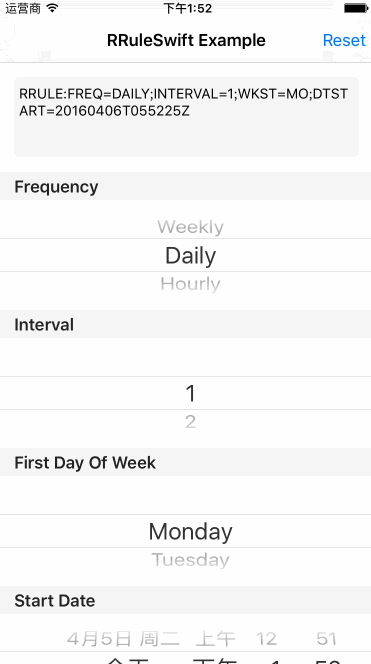

# RRuleSwift
Swift rrule library for working with recurrence rules of calendar dates.



RRuleSwift is based on [rrule.js](https://github.com/jkbrzt/rrule).

## How To Get Started
### Carthage
Specify "RRuleSwift" in your ```Cartfile```:
```ogdl 
github "teambition/RRuleSwift"
```

### Usage
#### Initialization
```swift
var recurrenceRule = RecurrenceRule(frequency: .daily)
recurrenceRule.calendar = ...
recurrenceRule.frequency = ...
recurrenceRule.interval = ...
recurrenceRule.firstDayOfWeek = ...
recurrenceRule.startDate = ...
recurrenceRule.recurrenceEnd = ...
recurrenceRule.bysetpos = ...
recurrenceRule.byyearday = ...
recurrenceRule.bymonth = ...
recurrenceRule.byweekno = ...
recurrenceRule.bymonthday = ...
recurrenceRule.byweekday = ...
recurrenceRule.byhour = ...
recurrenceRule.byminute = ...
recurrenceRule.bysecond = ...
recurrenceRule.rdate = ...
recurrenceRule.exdate = ...
```

####  Rule form string
```swift
let ruleString = "RRULE:FREQ=MONTHLY;DTSTART=20160404T021000Z;COUNT=5;INTERVAL=2;WKST=MO;BYDAY=MO,TU"
let rule = RecurrenceRule(rruleString: ruleString)
```

####  String form rule
```swift
let ruleString = rule.toRRuleString()
print(ruleString)
// RRULE:FREQ=MONTHLY;DTSTART=20160404T021000Z;COUNT=5;INTERVAL=2;WKST=MO;BYDAY=MO,TU
```

#### Inclusion date and Exclusion date
```swift
let rdateString = "RDATE:20180706T160000Z,20210706T160000Z"
if let inclusionDate = InclusionDate(rdateString: rdateString) {
    print(inclusionDate.toRDateString())
    // RDATE:20180706T160000Z,20210706T160000Z

    print(inclusionDate.dates)
    /*
    2018-07-07 00:00:00 Sun
    2021-07-07 00:00:00 Sun
    */
}

let exdateString = "EXDATE:20181231T160000Z,20201231T160000Z"
if let exclusionDate = ExclusionDate(exdateString: exdateString, granularity: .year) {
    print(exclusionDate.toExDateString())
    // EXDATE:20181231T160000Z,20201231T160000Z

    print(exclusionDate.dates)
    /*
    2019-01-01 00:00:00 Tue
    2021-01-01 00:00:00 Fri
    */
}
```

#### Occurrence iterator
```swift
let ruleString = "RRULE:FREQ=YEARLY;COUNT=11;WKST=MO"
if let rule = RecurrenceRule(rruleString: ruleString) {
    var rule = rule
    rule.rdate = inclusionDate // RDATE:20180706T160000Z,20210706T160000Z
    rule.exdate = exclusionDate // EXDATE:20181231T160000Z,20201231T160000Z
    let allDates = rule.allOccurrences()
    print(allDates)
    /*
    2016-04-14 14:22:30 Thu
    2017-04-14 14:22:30 Fri
    2018-04-14 14:22:30 Sat
    2018-07-07 00:00:00 Sat
    2020-04-14 14:22:30 Tue
    2022-04-14 14:22:30 Thu
    2023-04-14 14:22:30 Fri
    2024-04-14 14:22:30 Sun
    2025-04-14 14:22:30 Mon
    2026-04-14 14:22:30 Tue
    */

    let date = dateFormatter.date(from: "2018-01-01 00:00:00 Sun")!
    let otherDate = dateFormatter.date(from: "2024-01-01 00:00:00 Mon")!
    let betweenDates = rule.occurrences(between: date, and: otherDate)
    print(betweenDates)
    /*
    2018-04-14 14:22:30 Sat
    2018-07-07 00:00:00 Sat
    2020-04-14 14:22:30 Tue
    2022-04-14 14:22:30 Thu
    2023-04-14 14:22:30 Fri
    */
}
```

## Minimum Requirement
iOS 8.0

## Release Notes
* [Release Notes](https://github.com/teambition/RRuleSwift/releases)

## License
RRuleSwift is released under the MIT license. See [LICENSE](https://github.com/teambition/RRuleSwift/blob/master/LICENSE.md) for details.

## More Info
Have a question? Please [open an issue](https://github.com/teambition/RRuleSwift/issues/new)!
